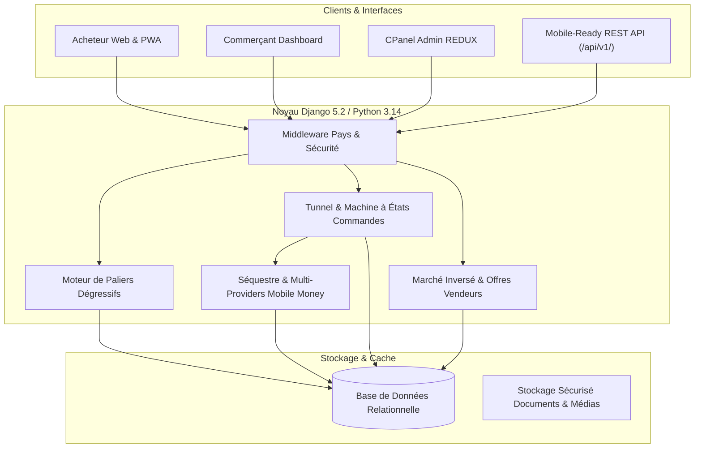

# Architecture Technique REDUX

REDUX est une plateforme panafricaine de commerce collectif dégressif et de marché inversé conçue pour les marchés d'Afrique subsaharienne francophone (Bénin, Côte d'Ivoire, Sénégal, Togo).

---

## 1. Vue d'Ensemble du Système

---

## 2. Découpage Modulaire des 18 Applications (`apps/`)

| Application | Rôle et Responsabilité |
| :--- | :--- |
| `core` | Modèle de base abstrait `TimeStampedModel`, `AuditLog`, tableau de bord admin personnalisé |
| `countries` | Gestion multi-pays (BJ, CI, SN, TG), devises (XOF), indicatifs téléphoniques et middleware de détection |
| `accounts` | Modèle `User` personnalisé (authentification par email/téléphone), RBAC (`BUYER`, `MERCHANT`, `ADMIN`) |
| `merchants` | Profils commerçants, soumission des pièces justificatives (RCCM, IFU) et modération du statut `VERIFIED` |
| `stores` | Boutiques rattachées aux commerçants vérifiés, géolocalisation et rattachement par pays |
| `catalog` | Arbre de catégories hiérarchique, fiches produits, gestion des images et des stocks de base |
| `pricing` | Moteur de tarification par paliers dégressifs (`calculate_current_tier`, `calculate_savings`, validation stricte) |
| `campaigns` | Campagnes d'achats groupés lancées par les commerçants, gestion de la concurrence (`select_for_update`) |
| `orders` | Cycle de vie des commandes, numérotation non prédictible `RDX-YYYYMM-XXXXXX`, protection anti-IDOR |
| `payments` | Abstraction multi-fournisseurs (MTN, Moov, Orange, Wave), traitement idempotent des webhooks HMAC |
| `deliveries` | Suivi logistique, confirmation de livraison sécurisée par code de retrait |
| `purchase_requests` | Modèle inversé : demandes d'achats groupés initiées par les acheteurs et offres formelles des vendeurs |
| `reviews` | Avis vérifiés post-achat et notation des marchands et produits |
| `disputes` | Gestion des litiges et médiation avec blocage des fonds sous séquestre |
| `notifications` | Dispatch multi-canal (Email, SMS, Web), protection anti-XSS et respect des préférences utilisateur |
| `commissions` | Calcul des commissions de plateforme REDUX sur les volumes clôturés |
| `pages` | Pages publiques (Accueil, Explorer, Comment ça marche, FAQ, CGU, PWA, SEO & Sitemaps) |
| `api` | Points d'entrée REST API v1 documentés via drf-spectacular (OpenAPI 3) |

---

## 3. Invariant Fondamental de Séparation

Pour garantir une intégrité transactionnelle irréprochable et empêcher toute manipulation de prix :

$$\text{User} \longrightarrow \text{CampaignParticipant} \longrightarrow \text{Order} \longrightarrow \text{Payment}$$

- Une commande n'est **jamais** créée sans une participation préalable enregistrée.
- Le montant d'une commande est **recalculé dynamiquement côté serveur** en interrogeant le palier en cours dans le moteur de prix.
- Le statut `PAID` d'une commande n'est déclenché **que par la réception et vérification cryptographique** d'un webhook émis par la passerelle de paiement.

---

## 4. Identité Visuelle & Charte Graphique

- **Couleur Primaire** : Orange Vibrant (`#FF6500`) — symbolise l'énergie, le commerce et l'Afrique créative.
- **Couleur Secondaire / Accent** : Bleu Nuit (`#0B2447` / `#19376D`) — évoque la solidité bancaire et la confiance.
- **Fonds & Surfaces** : Blanc Pur (`#FFFFFF`) et Ardoise Douce (`#F8FAFC`) — lisibilité maximale sur mobile et plein soleil.
