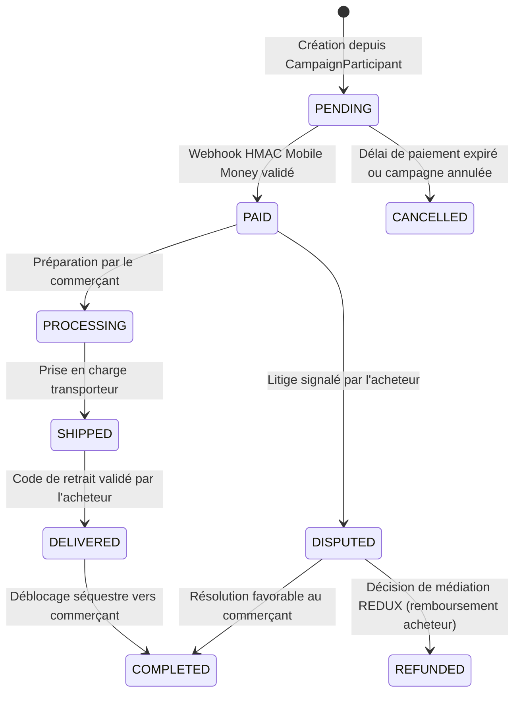

# Règles Métier & Logique Fonctionnelle REDUX

Ce document consigne les règles de gestion et algorithmes fondamentaux régissant la plateforme REDUX.

---

## 1. Moteur de Tarification Dégressive (Volume Pricing Engine)

1. **Définition des Paliers** :
   - Un palier $T_i$ est défini par un seuil minimal de participants $M_i$ et un prix unitaire $P_i$.
   - **Règle de monotonicité stricte** : Pour toute suite de paliers ordonnée par $M_1 < M_2 < \dots < M_n$, les prix doivent être strictement décroissants : $P_1 > P_2 > \dots > P_n$.
   - **Contrainte de prix plancher** : Aucun palier ne peut proposer un prix inférieur au prix plancher (`floor_price`) fixé par le commerçant.
2. **Calcul Dynamique du Prix Collectif** :
   - Dès qu'un nouvel acheteur s'engage dans la campagne, le compteur global de volume est incrémenté.
   - Le palier actif correspond au plus grand seuil $M_i \le \text{current\_volume}$.
   - Le prix final facturé à la clôture de la campagne est **le prix le plus bas atteint** pour l'intégralité des participants du groupe.
3. **Sécurisation de la Concurrence** :
   - Tout incrément de participant ou de quantité s'effectue sous verrouillage transactionnel explicite via `select_for_update()` dans `apps.campaigns.services.join_campaign`.

---

## 2. Cycle de Vie d'une Commande (Order State Machine)

Les transitions d'états d'une commande sont strictement encadrées :

---

## 3. Marché Inversé (Demandes d'Achats Groupés)

1. **Publication d'une Demande** :
   - Tout acheteur connecté peut publier une demande collective en spécifiant un titre, un descriptif, une quantité cible ($\ge 2$) et un prix cible ($> 0$).
   - L'initiateur est automatiquement inscrit avec une quantité de 1.
2. **Adhésion au Groupe** :
   - D'autres acheteurs peuvent rejoindre la demande avec la quantité de leur choix.
   - Un même acheteur ne peut pas soumettre d'adhésion en double (contrainte d'unicité en base de données).
3. **Propositions des Commerçants** :
   - Seuls les commerçants ayant le statut `VERIFIED` peuvent formuler une offre commerciale formelle.
   - L'initiateur (ou l'administrateur) a le pouvoir d'accepter une offre. L'acceptation d'une proposition rejette automatiquement les autres offres en attente et bascule la demande vers le tunnel d'achat.
