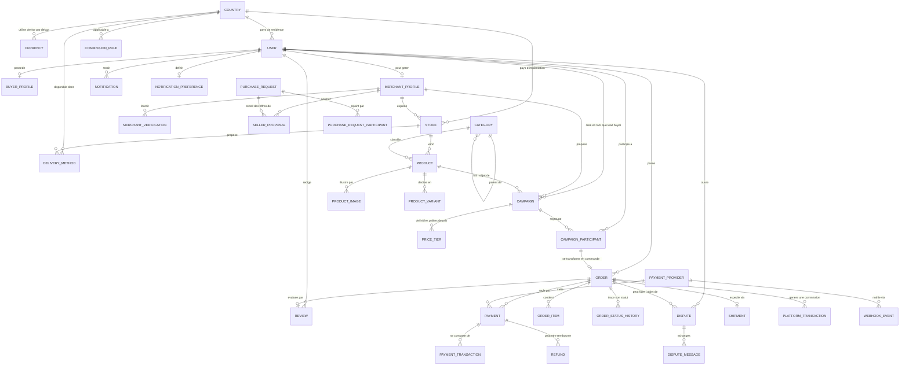

# REDUX — Entity Relationship Diagram (ERD)

Ce document décrit le modèle de données relationnel de la plateforme **REDUX**.

## Règles architecturales strictes
1. **User → CampaignParticipant → Order → Payment** : une participation n'est pas une commande.
2. **Double surface critique** :
   - Paiement validé uniquement côté serveur par webhook signé (`WebhookEvent`, `PaymentTransaction`).
   - Rôle `ADMIN` non auto-attribuable.
3. **Multi-pays** : Devises et pays gérés dynamiquement (`Country`, `Currency`).
4. **Append-only** pour la comptabilité : `PlatformTransaction` et `AuditLog`.
